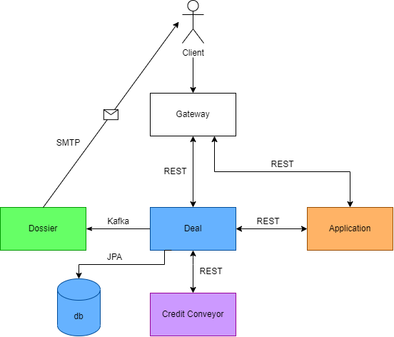
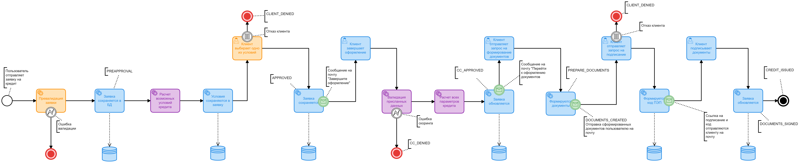
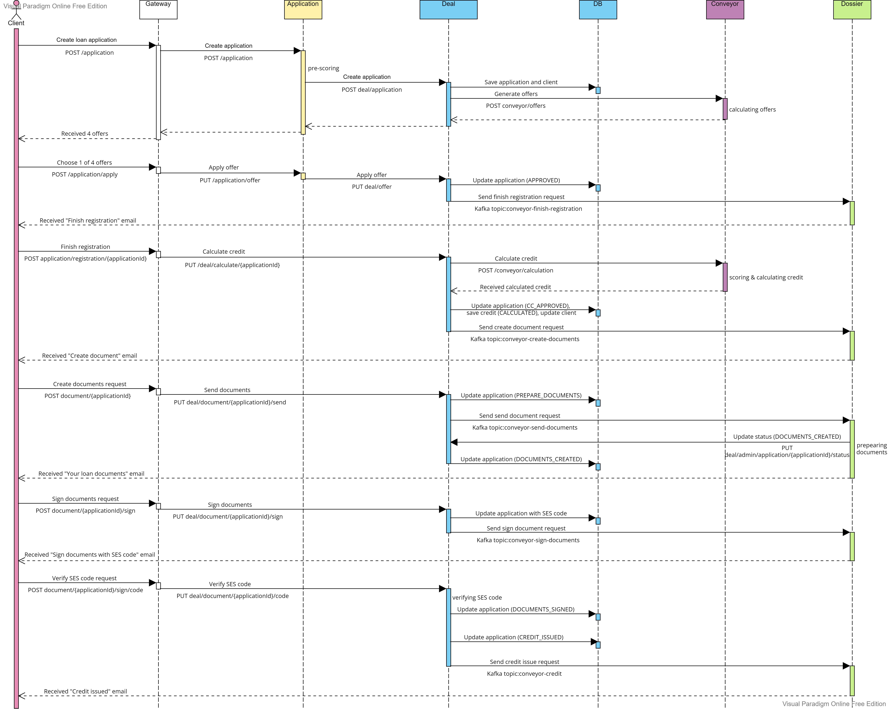
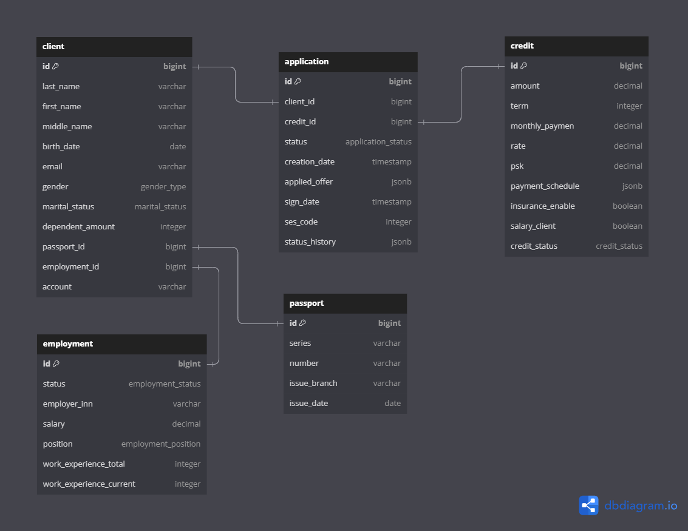

# «Кредитный конвейер»

**Приложение для рассчета и выдачи кредитов**

## Стек:

- Java 17
- Spring Boot 2.7.14/2.7.15
- PostgreSQL
- JPA
- Hibernate
- Maven
- Swagger
- Kafka
- JUnit
- Lombok
- Liquibase
- Feign Client
- RestTemplate
- Thymeleaf
- Docker
- Java Mail
- Dorny Paths Filter
- GitHub Actions

## Запуск проекта в Docker

1. Прописать логин и пароль для почты для отправки писем в файле secret.env;
2. Собрать все сервисы в пакеты .jar (например, через вкладку Maven: Maven -> Lifecycle -> application -> package);
3. Выполнить команду в терминале:
```shell
   docker-compose --project-name conveyor --file docker-compose.yml up
```

## Локальный запуск без Docker

1. Прописать логин, пароль, хост и порт для почты в переменных окружения среды разработки;
2. При необходимости заменить данные базы данных в сервисе Deal;
3. Подключиться к базе данных в среде разработки (вкладка Database);
4. Запустить сервисы, где присутствует application-local.yaml, локально (например, в main-классах: 
   Application.java -> Modify Run Configuration -> Active profiles: local -> ok) вручную.

## Управление

После запуска программы выполните переход по ссылке: [Swagger](http://localhost:8085/swagger-ui/index.html#/)

## Архитектура



## Логика работы

1. Пользователь отправляет заявку на кредит;
2. Микросервис Application осуществляет прескоринг заявки, и если прескоринг проходит, то заявка сохраняется в 
   микросервис Deal и отправляется в Conveyor;
3. Conveyor возвращает через Application пользователю 4 предложения по кредиту с разными условиями
   (например, без страховки, со страховкой, с зарплатным клиентом, со страховкой и зарплатным клиентом) или отказ;
4. Пользователь выбирает одно из предложений, отправляется запрос в Application, а оттуда - в Deal, где заявка на кредит 
   и сам кредит сохраняются в базу;
5. Deal отправляет клиенту письмо с предложением завершить оформление кредита;
6. Клиент отправляет запрос в Deal со всеми своими полными данными о работодателе и прописке. Происходит скоринг данных 
   в Conveyor. Микросервис рассчитывает все данные по кредиту (ПСК, график платежей и тд), Deal сохраняет обновленную 
   заявку и сущность Credit, сделанную на основе CreditDTO, полученного из Conveyor, со статусом CALCULATED в БД;
7. После валидации Deal отправляет письмо на почту клиенту с одобрением или отказом. Если кредит одобрен, то в письме 
   предлагают сделать запроос на формирование документов;
8. Клиент отправляет запрос на формирование документов в Deal, Deal отправляет клиенту на почту документы для подписания;
9. В случае согласия клиент отправляет запрос на подписание документов. Deal отправляет на почту клиента секретный код;
10. Если полученный код совпадает с отправленным, Deal выдает кредит (меняет статус сущности Credit на ISSUED, а статус 
   заявки на CREDIT_ISSUED).

## Business-flow



## Легенда:

Цвета:

- Оранжевый: Application
- Голубой: Deal + Database
- Фиолетовый: Conveyor
- Зеленый: Dossier
- Красный: конец флоу

Типы действий:

- Иконка «человек» сверху слева: пользовательское действие
- Иконка «зубчатое колесо» сверху слева: действие системы
- Иконка «молния»: ошибка
- Иконка «прямоугольник с горизонтальными полосками»: выбор пользователя
- Иконка «конверт»: асинхронная отправка email-сообщения на почту

## Sequence-диаграмма



## Диаграмма базы данных

